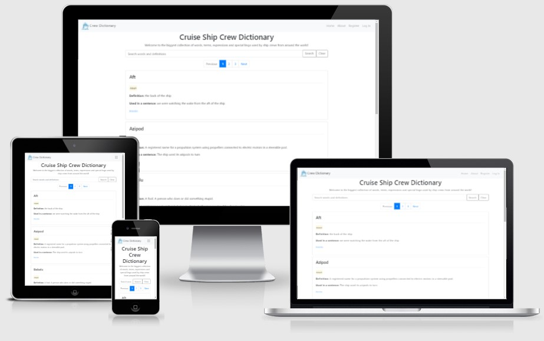

# ms3-crew-dictionary
Cruise Ship Crew have their own language and as part of my Milestone 3 project I'm creating a dictionary of ship related terms and crew language.

Since working on a cruise ship I tried to find a resource where I can remember the words and terminology I used onboard with my fellow crew memebers. As we all know, any language that is not used is lost. I did not want to lose this language so I developed a dictionary where I can store all the words I used while working on ships. 
I also hope to release this website once it is graded for the milestone project and after a few more fixes which need to be done and those are referenced in the readme below. 

# UX

This is a dictionary and the main focus are the words and definitions submitted by users. For this reason, the landing page allows anyone, whether registered or unregistered to browse the list of words in the dictionary. 
The design is clean with few distractions to alow for focus to the words themselves. The main dictionary page is paginated to prevent endless scrolling as more words are added and features a search bar where users can search for words or definitions.
When landing on the first page, users can navigate to the "About" page which explains the purpose of the dictionary, users can register an account or log in if they already have an account. The design of the page is minimalistic as the whole purpose of the site is to allow users to browse and/or add words to the dictionary. 

## General

## User Stories

## Wireframes

# Features

## Dictionary

## Navigation

## Footer

## About

## Register

## Log In

## User Tools

## Profile Dashboard

## Submit Word

## Change Password

## 404 pages

## Search

## Log Out

# User Types and permissions

## User

## Editor

## Admin

# CRUD - Create, Read, Update and Delete

## Create

## Read

## Update

## Delete

# Technologies Used

# Testing

## Code Validation

## Manual Testing

## Testing Scenarios

# Deployment

## Heroku

## Local Deployment

# Credits

## Media

## Tutorials

## Acknowledgements

