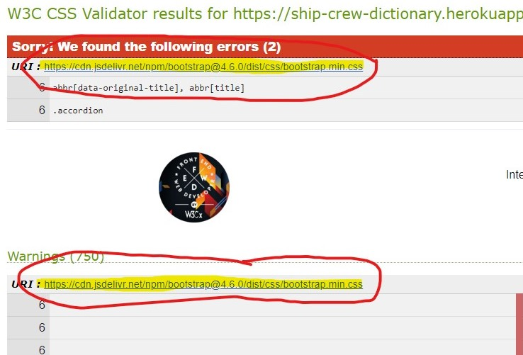

# ms3-crew-dictionary
Cruise Ship Crew have their own language and as part of my Milestone 3 project I'm creating a dictionary of ship related terms and crew language.

Since working on a cruise ship I tried to find a resource where I can remember the words and terminology I used onboard with my fellow crew memebers. As we all know, any language that is not used is lost. I did not want to lose this language so I developed a dictionary where I can store all the words I used while working on ships. 
I also hope to release this website once it is graded for the milestone project and after a few more fixes which need to be done and those are referenced in the readme below. 

# UX


The main focus of this dictionary are the words and definitions submitted by users. For this reason, the landing page allows anyone, whether registered or unregistered to browse the list of words in the dictionary. 
The design is clean with few distractions to alow for focus to the words themselves. The main dictionary page is paginated to prevent endless scrolling as more words are added and features a search bar where users can search for words or definitions.
When landing on the first page, users can navigate to the "About" page which explains the purpose of the dictionary, users can register an account or log in if they already have an account. The design of the page is minimalist and simple as the whole purpose of the site is to allow users to browse and/or add words to the dictionary. 

## General
The Cruise Ship Crew Dictionary is a simple dictionary designed in a minimalist style. The main elements of the page are the navigation bar at the top of the page, the main body where the words and definitions are displayed and the footer. Users are able to browse the dictionary and search for words and definitions without registering or logging in. For those who would like to contribute to the dictionary, they have the option to register an account in order to submit new words. When a user logs in, they are redirected to a user dashboard where they can see all of the words they have submitted separated into those which have been approved by an editor or administrator, and those words which are pending approval. Overall, the website follows a similar design pattern on all pages which was achieved using bootstrap as the front end framework. 

## User Stories

<details>
<summary><strong>User stories from a perspective of a visitor</strong></summary>
<br>
<ol>
<li>As a visitor I want to easily view the dictionary</li>
<p>The dictionary is the first page when a visitor navigates to the website and is fully accessible to all visitors.</p>
<li>As a visitor I want to search for specific words</li>
<p>A search bar is available on the main dictionary page to search all words and definitions.</p>
<li>As a visitor I want to find out more information about this dictionary</li>
<p>An about page is available in the navigation bar which gives additional information about the dictionary. 
The footer also includes the mission statement for the dictionary. The footer is at the bottom of every page.</p>
<li>As a visitor I want to register for an account</li>
<p>The register page allows any visitor to register for an account</p>
<li>As a visitor I want to easily navigate the page</li>
<p>The main dictionary page is paginated with 5 word cards on each page. This makes navigation easy and prevents the user from having to scroll through the whole list of words.</p>
</ol>
</details>
<br>
<details>
<summary><strong>User stories from a perspective of a user</strong></summary>
<br>
<h3>Registerd users have all the rights and permissions of visitors</h3>
<ol>
<li>As a user I want to log in</li>
<p>The log in page is accessible by following the link to the login page in the navigation bar in the top right.</p>
<li>As a user I want to submit a new word</li>
<p>When a user logs in they are directed to their user dashboard with a button to submit a new word. This option is also available in the "User Tools" dropdown menu</p>
<li>As a user I want to see the status of my submissions</li>
<p>After submitting a word, the user is redirected back to their dashboard where they can see all of their submitted words categorised into either "approved" or "pending approval".</p>
<li>As a user I want to edit words</li>
<p>From the user dashboard, users are able to edit words which are pending approval.</p>
<li>As a user I want to log out</li>
<p>The user can log out of their account by going to the "Log out" link in the "User Tools" dropdown menu on the navigation bar.</p>
<li>As a user I want to change my password</li>
<p>The user can change their password by going to the "Change Password" link in the "User Tools" dropdown menu on the navigation bar.</p>
</ol>
</details>
<br>
<details>
<summary><strong>User stories from a perspective of an editor</strong></summary>
<br>
<h3>Editors have all the rights and permissions of registered users</h3>
<ol>
<li>As an editor I want to approve words submitted by users</li>
<p>When any logged in user submits a word, it must fist be approved by an editor before it is published to the main dictionary. The editor can approve words in the editor dashboard.</p>
<li>As an editor I want to reject a submitted word.</li>
<p>On the editor dashboard, editors can reject a submitted word by clicking on the "Reject" button if the word is not relevant to the dictionary.</p>
<li>As an editor I want to edit words</li>
<p>Editors can edit words before they are approved in the editor dashboard. Editors can also edit any word in the main dictionary by clicking "Edit" next to the word in the main dictionary or serach page</p>
<li>As an editor I want to delete words</li>
<p>If an editor thinks a word is no longer relevant, they can delete that word from the dictionary by either navigating to it in the main dictionary or by searching for the word and deleting it in the search page.</p>
</ol>
</details>
<br>
<details>
<summary><strong>User stories from a perspective of an administrator</strong></summary>
<br>
<h3>Administrators have all the rights and permissions of editors</h3>
<ol>
<li>As an administrator I want to control user types for all registerd users</li>
<p>Administrators have the right to change any registerd user between "user", "editor", "admin".</p>
<li>As an admin I don't want to edit my user type by mistake</li>
<p>An administrator cannot change their own user type.</p>
</ol>
</details>
<br>


## Wireframes
The wireframes were created at the beginning and throughout the project to aid with the front end design. Below are links to the original designs for both desktop and mobile. 

[Dictionary Home Page](wireframes/home_page.png "Desktop and Mobile - Home Page")

[Log In Page](wireframes/log_in_page.png "Desktop and Mobile - Log In Page")

[Register Page](wireframes/register_page.png "Desktop and Mobile - Register Page")

[User Dashboard](wireframes/user_dashboard.png "Desktop and Mobile - User Dashboard")

[Editor Dashboard](wireframes/editor_dashboard.png "Desktop and Mobile - Editor Dashboard")

[Admin Panel](wireframes/admin_panel.png "Desktop and Mobile - Admin Panel")


# Features

## Dictionary
The dictionary is set as the main and landing page of the website. When a visitor navigates to the website they will see the dictionary. The dictionary consists of the navigation bar on the top, a title, a search bar, words and definitions and a footer element. The main parts of the dictionary are the search bar and the word cards which are displayed underneath. Visitors can search for specific words or terms in the definitions or they can browse the list of words. The list of words is paginated and each page will show 5 word cards.

## Navigation

The navigation bar at the top of the page has the page title and logo aligned to the left side and the links aligned to the right side. The links displyed on the navigation bar change depending on the log in status of the user. If a visitor is not logged in, they will see a link for the home page, the about page, the register page and the log in page. 

If a user is logged in, they do not see the register and log in page links, but instead see a "User Tools" dropdown menu. 
In the user tools menu, logged in users can see their profile dashboard, they can submit a new word, change their password and log out. 
## Footer
The footer is standard across all pages on the website and it shows the mission statement for the website, a contact link which links to a contact page (The contact page is not set up to work), a sitemap which is currently dissabled and the about page. There is also a copyright symbol at the very bottom. 

## About
The about page provides information about the dictionary and the reason why it was created.

## Register
The register page offers visitors the posiblity to register to become users and contribute to the dictionary. 
The visitor needs to select a username and password. Form validation is in place to make sure the username is not shorter than 5 characters. Another form validation rule is to make sure the user inputs the same password twice to avoid any typos. If the passwords don't match, the user will be prompted to correct it. 
If the username the user choses is already taken, the application will inform the user to choose another username.
If the user on this page already has an account, there is a link underneath the submit button to take them to the log in page. 

## Log In
Users who have an account can submit their username and password to log into their account. 
If a visitor does not have an account, a link at the bottom of the form will take them to the registration page. 
Once the user enters their username and password and logs in, they will be taken to their user dashboard. 


## User Tools
When a user logs in, the "Register" and "Log In" links on the navigation bar will change to a "User Tools" dropdown menu. 
In the user tools, the user can access their dashboard, submit a new word to the dictionary, change their password and log out. 
The user tools were put into a dropdown menu as a design decition to not clutter the navigation bar, especially no mobile devices. 
## Profile Dashboard
When a user logs into their account, they will be taken directly to the user dashboard. Depending on the user type, they will see a different dashboard. 
If a regular user logs in, they will see the page title as "[username] Dashboard". Underneath the title is a button to submit a new word to the dictionary and underneath that is an accordion with two sections. The first section is a list of all words the user has submitted and which were approved. The second section are all words that the user has submitted which are waiting to be approved by an editor or admin. 

Editors see everything a user sees, but they have an additional section on the top of the accordion with a list of words waiting for approval. 

Administrators see everything the editor sees, however, next to the submit a word button, administrators will see a button to change user status. 
## Submit Word
All registered users, editors and administrators can submit a new word. 
Submitting a new word is done through a form which has the following elements: 
- Word - which word is being defined
- Type - what is the word type (noun, verb, adjective)
- Definition - what is the definition of the word?
- Use in sentence - how to use the word in a sentence

Users then have a choice to submit their word or to cancel and return to the dashboard. 
## Change Password
If a user wishes to change their password, they will be prompted for their old password and to enter a new password. There is a form validator on the server side to make sure the old password is correct as well as a client side validator to make sure the new password has been entered correctly twice. 

## 404 pages
If a user navigates to a page which does not exist or if they do not have permission to access, they will be directed to a 404 error page. 

## Search
On the main dictionary page, users can search for specific words located either in the word field or the definition. 

# Features to implement in future updates

- Expand user profiles and dashboards so that registerd users / editors / admins can add more information about themselves
- When anyone clicks the link on a word card to take them to the user profile which displays all words submitted by user including additional information about the user
- Counter which increments for every published word for a user. Administrators can then promote the most active users
- Option to delete a user by an admin and for users to delete their accounts. 
- Ability for a user to reset their password if they forget it. 
- Refactor code to include a better data structure to hold user sessions

# User Types and permissions
There are four types of users that this website is designed for:

## Visitor
A visitor is anyone who navigates to this website and can see the dictionary. Visitors can view words and definition, the about page and they can register for an account. 
The page is fully functional for read only access for visitors. 
## User
A visitor who registeres for an account automatically becomes a "user". Users have the same rights as visitors, plus they have access to a dashboard and to submit words to the dictionary. 
Any word a user submits is first sent to an editor to check and approve. Once approved, the word is published to the dictionary. 
## Editor
Editors have all the rights of a user, but also have the responsibility to check and approve user submitted words. Editors can also edit and delete words from the dictionary.
## Admin
Administrators have all the rights of an editor, but they also have the right to change user types for all users between user / editor / admin. They can change any user except themselves. This is a security feature so that an administrator doesn't accidentaly change their own permissions. 
# CRUD - Create, Read, Update and Delete
As part of the milestone project, we have to demonstrate that our application can perform CRUD operations.

|   	|  Create 	|  Read 	| Update  	| Delete  	|
|---	|---	|---	|---	|---	|
| Visitor  	| No  	| Yes  	| No  	| No  	|
|  User 	| Yes  	|  Yes 	| Yes  	|  No 	|
| Editor  	|  Yes 	| Yes  	| Yes  	| Yes  	|
| Admin  	|  Yes 	| Yes  	| Yes  	|  Yes 	|

As seen in the table above, all CRUD functionality is present in the application, however, CRUD operations are restricted to some user types. 

## Create

### Submit new word
All users, editors & admins are able to submit new words to the dictionary. Each submission creates a new record in the database.

### Register new user
Anyone who does not have an account is able to register for an account. The register function creates a new record in the database for that user. 

## Read

### Display words from the database
All visitors, users, editors and admins are able to read records from the database in the form of words in the dictionary. The application reads from the words collection in the database and displays the words in the dictionary.

### Search
All visitors, users, editors and admins are able to search for words within the dictionary. This function reads from the database and displays the searched terms on the search page

### Search by "submitted by"
All visitors, users, editors and admins are able to search by user submitted words. Each word card in the dictionary has an entry of who submitted this word. By clicking on the link, the application reads from the database and displays all words submitted and approved by that particular user. 

## Update

### Edit words
All editors and administrators have the ability to update or edit words submitted by other users. Editors and administrators can see edit buttons next to each word in the dictionary itself, or on their user dashboards. When editing a word, the application updates the record of that word with new values.

Users have the ability to update words which they have submitted before the words are approved. This option is available in the user dashboard for each user. The application updates the values in the record for that word and sends the word to an editor or administrator for review. 

### Edit user types
Admins have the right to update user types. Admins have an additional option in the dashboard where they can choose a user and update their type between user / editor / admin. However, administrators cannot update their own type as a security measure so that they do not accidentally remove their own permissions. 

## Delete

### Reject words
Editors and administrators have the ability to reject words submitted by other users. The application then removes that word from the collection.

### Delete word
Editors and administrators have the ability to delete words which have been submitted and approved. This is in case a word is approved accidentally so that it can be deleted from the dictionary. The application removes the word from the collection. 

# Mongo DB Databse Structure
The database used for this project is MongoDB. The main database contains three collections. 
- Categories 
- Users
- Words

### Categories
This collection contains the word categories. Each word can be either a noun, verb or adjective. These categories are pulled into the forms to submit or edit words. 

```
_id: ObjectID
category_name: String
```

### Users
The users collection stores all the data about registered users. The strucutre of the users collection is: 

```
_id: ObjectID
user_name: String
user_password: String 
user_type: String
```
The user_password string is hashed using the Werkzeug password hash function

### Words
The words collection stores all the words, definitions, uses and other processing information. The structure of the collection is:

```
_id: ObjectID
word: String
word_category: String
word_definition: String
word_sentence: String
word_submitted_by: String
word_approved_by: String
word_status: String
word_submitted_datetime: Date
```

# Technologies Used

## Languages
* [HTML](https://en.wikipedia.org/wiki/HTML) - HyperText Markup Language - used to build up the foundation of the webpages in this project. Mostly used in files ending in `.html`
* [CSS](https://en.wikipedia.org/wiki/CSS) - Cascading Style Sheets - Used to style the pages in this project. Located in files ending with `.css`
* [JavaScript](https://en.wikipedia.org/wiki/JavaScript) - JavaScript - Used to provide form validation on the Register and Change Password Pages. File ending in `.js`
* [Python](https://www.python.org/) - Used to build the back end of the web application. Stored in files ending with `.py`

## Libraries

* [Bootstrap 4.6](https://getbootstrap.com/docs/4.6/getting-started/introduction/) - A front end framework used extensivelly in this project
* [Flask](https://flask.palletsprojects.com/en/2.0.x/) - A lightweight WSGI web application framework used for routing and backend of this project.
* [Jinja](https://www.palletsprojects.com/p/jinja/) - Template engine used to render web pages and components
* [Pymongo](https://pypi.org/project/pymongo/) - a component imported into Python to allow access and CRUD operations with a mongoDB database

## Hosting

* [Heroku](https://www.heroku.com/home) - A web hosting service that supports Python applications.
## Tools

* [MongoDB Atlas](https://www.mongodb.com/) - Document database to store data using NOSQL for this project
* [GitHub](https://github.com/) - A cloud based code repository used to store all code files for this project
* [VSCode](https://code.visualstudio.com/) - A cross platform code editor used to develop this project
* [Microsoft Edge](https://www.microsoft.com/en-us/edge?r=1) - Web browser used for testing and page preview
* [Google Chrome](https://www.google.com/intl/en_ie/chrome/) - Web browser user for testing
* [Mozilla Firefox](https://www.mozilla.org/en-US/firefox/new/) - Web browser used for testing
* [Markdown Table Generator](https://www.tablesgenerator.com/markdown_tables) - Used to design the tables used in this readme file
* [Balsamiq](https://balsamiq.com/wireframes/?gclid=CjwKCAjw-e2EBhAhEiwAJI5jg_33A7TEqNM59vO9PjRpE-ZjzkpAgjcfU7TXsKZhu4a3puGdzFaM3hoCqIUQAvD_BwE) - Wireframe creation tool. Used to design initial templates for the website pages

## Testing
* [Am I Responsive](http://ami.responsivedesign.is/) - Testing responsive design
* [W3C Markup Validation Service](https://validator.w3.org/) - Testing that all HTML code is valid
* [W3C CSS Validation Service](https://jigsaw.w3.org/css-validator/) - Testing that all CSS code is valid
* [JS Hint](https://jshint.com/) - Testing that all javascript code is valid
* [PEP8 Online](http://pep8online.com/) - Testing that all python code is valid
* [GTMetrix](https://gtmetrix.com/) - Loading time testing

# Testing

## Code Validation
### W3C Markup Validation Service
The W3C Markup Validation Service Validates HTML code of the webpage. The main URL and all other page URLs were fed into the validator and returned no issues


### W3C CSS Validation Service
The W3C Css Validation Service validates the CSS code on the website. When the root page of the website was passed through the validation tool, the tool identified 2 errors and 750 warnings. However, all errors and warnings were related to the Bootstrap library as seen in the screenshot below. 


### JSHint
The JavaScript code used for form validation on the Register page and Change Password page was fed to the JSHint validator. There were no errors with the code, however, the tool identified that the function checkPassword() is not called in the script. However, it is called in the input field of the register and change password forms. 


### PEP8 Online
The PEP8 online checks the validity of the python code in the app. The validation tool found no issues with the code.


### GTMetrix
GTMetrix evaluates the load time for the website and overall efficiency. The tool rates this website with an A for optimisation. 
Initially the rating was a B and the suggestion was to remove the bootstrap library from the local directory and use CDN instead. This dramatically decreased the load time for the website. 

## Manual Testing

The site was continually tested throught the development process. The testing was done to ensure wesite responsivness to all screen sizes, that all user stories were functional and that the website was free of bugs. The testing was done on multiple devices and multiple browsers. At the end of the project all tests were successfull and the site is fully responsive and free of all anticipated bugs. 
### Testing devices
- Desktop PC
- Asus Zenbook laptop
- Samsung Galaxy S10e
- OnePlus Nord
- Samsung Galaxy Tab A8

### Testing Browsers
- Microsoft Edge
- Google Chrome
- Mozilla Firefox

## Testing Scenarios 
The testing methodology for this project was to walk through all of the user stories and ensure that all user stories exectute. 
The site was tested for responsivness by testing in Chrome Dev Tools and also on multiple phisical devices. Finally, the routing and security of the site was tested by manipulating the URL to try and access areas of the website without permission. All tests were completed successfully with no issues. 

### User Story Testing
Due to table better table formatting - user story testing is available at the link below:<br>
[User Story Testing](TESTING.md)


# Deployment
This site is deployed on [Heroku](https://www.heroku.com/home). Heroku is a free online hosting service for applications using multiple languages including Python. For this reason, it was chosen to host this project. To deploy this app on Heroku please follow the steps outlined below:
## Heroku
1. Navigate to the repository for this project [ms3-crew-dictionary](https://github.com/bowets/ms3-crew-dictionary) and click on the green button to open the menu

2. You can either download the zip file and extract it into your local directory or copy the link to the repository and clone it in the command line


3. Create a new repository in Github and push this project into the new repository.


4. Log in to [Heroku](https://www.heroku.com/home) if you have an account or if you do not have an account, create a new account.


5. when in the Heroku dashboard, click on the "New" button and then select "Create new app"

6. On the next screen enter an app name (must be unique) and select the region closest to you. 

7. In the deploy section, click on "Connect to GitHub"

8. Select your github user account and search for the repository that you want to deploy.

9. If you want, you can enable Automatic Deployment. This will build your application each time you push any changes to GitHub.

10. Navigate to settings and select "Reveal Config Vars. Here you will enter the configuration keys and values from your env.py file. They should look similar to this:
- IP: ```0.0.0.0```
- PORT: ```5000```
- MONGO_DBNAME: [name of your database]
- MONGO_URI: ```mongodb://<dbuser>:<dbpassword>@ds225442.mlab.com:25442/<dbname>```
- SECRET_KEY: [any string of characters. the longer the better]


11. Now go back to the "Deploy" tab and click on "Deploy Branch"

12. The website should be deployed on ```https://[your_app_name].herokuapp.com/```

## Local Deployment
1. Create a development project folder and navigate to it
``` cd /[folder path]```
2. Initialise Git
``` git init```
3. Clone the project repository into your local development folder
``` git clone https://github.com/bowets/ms3-crew-dictionary.git```
2. Install Python 3
3. Install Pip
4. Create a virtual environment for your local project
5. Install Flask
6. Install PyMongo
7. Install the packages in the requirements.txt file
8. Create an env.py file with the following parameters:
- IP: ```0.0.0.0```
- PORT: ```5000```
- MONGO_DBNAME: [name of your database]
- MONGO_URI: ```mongodb://<dbuser>:<dbpassword>@ds225442.mlab.com:25442/<dbname>```
- SECRET_KEY: [any string of characters. the longer the better]

The project already contains a ```.gitignore``` file which contains env.py
9. Run the project ```python app.py```

# Credits
## Media

* [TopPNG](https://toppng.com/cruise-ship-clip-art-cruise-ship-encode-clipart-to-cruise-ship-clipart-black-and-white-PNG-free-PNG-Images_164796) - Favicon and Navbar brand image
* [Pixabay](https://pixabay.com/photos/lighthouse-light-sea-beacon-coast-2611199/) - Image used in "About" page by Evgeni Tcherkasski

## Dictionary terms
Some words in this dictionary were taken from the below resources

* [Ship Dictionary](https://onboardwithlouis.wordpress.com/dictionary/)
* [Cruise Ship Diary](https://milimundo.com/typical-crew-vocabulary-cruise-ships/)
* [Cruise Ship Crew Dictionary](https://crew-center.com/cruise-ship-crew-dictionary-0)

## Code
Code snippets implemented in this project are credited below and in the file comments:

* [Footer Sticks to bottom of the page](https://stackoverflow.com/questions/40853952/bootstrap-footer-at-the-bottom-of-the-page/60780493#60780493) - Credit to Robert Beckson
* [Flask Error Handling](https://www.askpython.com/python-modules/flask/flask-error-handling) - Tutorial for Flask error handling
* [Pagination](https://github.com/mirofrankovic/cookbook-trisport-project-03/blob/master/app.py#L26-L103) - Taken from project "cookbook-trisport-project-03" by mirofrankovic and modiffied to suit this project
* [Check if authenticated user](https://github.com/NgiapPuoyKoh/ai-chat-annotator/blob/7b37842579f8d1783de8d11be544f9790b248f05/app.py#L534) - Taken from project ai-chat-annotator by NgiapPuoyKoh
* [Password validation](https://stackoverflow.com/questions/21727317/how-to-check-confirm-password-field-in-form-without-reloading-page/21727518) - Taken from StackOverflow


## Acknowledgements

My mentors Ignatius Ukwuoma and Guido Cecilio who provided feedback, learning resources and most importantly their time to ensure this project is completed and that the learning outcomes are achieved. 

The Code Institute Slack community who helped in time of crisis and for providing feedback and peer review. Most of the provided suggestions have made it to the final product. 


